<!-- ============================================= -->
<!--                   BANNER                       -->
<!-- ============================================= -->

  

<!-- ============================================= -->
<!--              TYPING ANIMATION                  -->
<!-- ============================================= -->

<!-- ============================================= -->
<!--                  SOCIALS                       -->
<!-- ============================================= -->

  
  
  
  

 

<!-- ============================================= -->
<!--                 HIGHLIGHTS                     -->
<!-- ============================================= -->

| 📄 Publications | 🎤 Conferences | 🎓 Education | 🌍 Domain |
|:---:|:---:|:---:|:---:|
| **2 peer-reviewed**   + under review | **AGU · EGU**   *invited talks* | **Ph.D. + M.Sc.**   Deep Learning | **Hydrology**   Climate AI |

 

<!-- ============================================= -->
<!--                    ABOUT                       -->
<!-- ============================================= -->

## 🧭 &nbsp; About

I design deep learning systems at the intersection of **geoscience, climate, and modern ML** — combining classical signal processing (**wavelets, decomposition**) with state-of-the-art neural architectures (**GRU, LSTM, Transformer, KAN**) and **LLM-powered explainability** to turn black-box predictions into actionable insight for environmental decision-making.

Currently a postdoctoral researcher at **M2C – CNRS** (Université de Rouen Normandie) through August 2026 — open to **Research Scientist**, **Applied Scientist**, and **ML Engineer** roles in industry.

 

<!-- ============================================= -->
<!--               RESEARCH FOCUS                   -->
<!-- ============================================= -->

## 🔬 &nbsp; Research Focus

<table>
<tr>
<td width="50%" valign="top">

### 💧 Hydroclimatic Forecasting
Groundwater levels, streamflow, and extreme floods — deep learning fused with physical priors and climate reanalysis (ERA5).

### 🌊 Time Series Deep Learning
LSTM · GRU · BiLSTM · Transformer · **KAN / TKAN** — benchmarked with KGE, NSE, CFD metrics.

</td>
<td width="50%" valign="top">

### 🌀 Wavelet-Enhanced ML
MODWT decomposition (LA(8), multi-level) as a frontend for deep sequence models — improving signal-to-noise on non-stationary series.

### 🛰️ Remote Sensing & XAI
Sentinel-1 SAR flood segmentation · LLM-powered natural-language reporting for interpretable geoscience workflows.

</td>
</tr>
</table>

 

<!-- ============================================= -->
<!--              PUBLICATIONS                      -->
<!-- ============================================= -->

## 📚 &nbsp; Selected Publications

> 📝 *[FILL IN — paper titles, venues, and DOIs below]*

- **[Paper Title 1]** &nbsp; *Journal of Hydrology: Regional Studies, 2025*  
  Deep learning framework for extreme flood prediction on the Seine River Basin, introducing a quantile-tail-huber loss function for imbalanced hydrological extremes.  
   &nbsp; 

- **[Paper Title 2]** &nbsp; *Journal Name, Year*  
  Brief one-line description of the contribution.  
  

- **[Paper Title 3 — under review]** &nbsp; *Journal Name*  
  Brief one-line description.

📖 Full publication list on [**ResearchGate**](https://www.researchgate.net/profile/Imad-Janbain).

 

<!-- ============================================= -->
<!--                 TECH STACK                     -->
<!-- ============================================= -->

## 🛠️ &nbsp; Tech Stack

#### ⚡ Core Expertise

  
  
  
  
  
  

#### 🔧 Production & Tools

  
  
  
  
  
  
  
  

#### 🌍 Geoscience & Remote Sensing

  
  
  
  
  

#### 🌱 Actively Exploring

  
  
  
  
  

 

<!-- ============================================= -->
<!--             FLAGSHIP PROJECTS                  -->
<!-- ============================================= -->

## 🚀 &nbsp; Flagship Projects

### 💧 &nbsp; Wavelet + Deep Learning for Groundwater Forecasting

> **End-to-end production-grade pipeline** · MODWT signal decomposition + GRU/LSTM/BiLSTM + Optuna HPO + ERA5 climate inputs.

**Highlights**
- MODWT decomposition (**LA(8), 4 levels**) improves SNR on non-stationary groundwater series
- Optuna Bayesian search across architecture + hyperparameters
- Full visualization module (`wavelet_viz.py`) for reproducible result inspection
- Evaluated on real basin data with **KGE / NSE / CFD** metrics *(add your best scores here)*

&nbsp;

---

### 🌊 &nbsp; River Discharge Forecasting with LLM Explainability

> **Research → production bridge** · Multi-model forecasting on USGS streamflow with Claude-powered narrative reports.

**Highlights**
- Hybrid modeling: **ARIMA** (baseline) · **XGBoost** (structured) · **BiLSTM** (sequential)
- End-to-end pipeline: ingestion → feature engineering → modeling → evaluation
- **LLM layer** generates human-readable explanations of model outputs — bridges the gap between quantitative forecasts and decision-maker insight
- Dockerized for reproducibility

&nbsp;

 

### 📁 &nbsp; More Projects

| Project | Summary | Stack |
|---|---|---|
| 🛰️ **[Sentinel-1 Flood Segmentation](https://github.com/Imad-Janbain/Sentinel-1-Satellite-Flood-Segmentation-with-Deep-Learning)** | Semantic segmentation of flooded areas from SAR imagery with U-Net architectures. | PyTorch · SAR · rasterio |
| 🧠 **KAN Hydroclimatic Study** | Integration of Kolmogorov–Arnold Networks in a wavelet-based DL pipeline, benchmarked vs. Wavelet–GRU. | KAN · PyTorch · Wavelets |
| ⏱️ **[Time Series Imputation](https://github.com/Imad-Janbain/Mini-Lookback-Strategy-for-Time-Series-Imputation-with-Deep-Learning)** | Lightweight mini-lookback DL strategy for gap-filling hydrological series. | PyTorch · Imputation |
| 📄 **[OCR + LLM Extraction](https://github.com/Imad-Janbain/LLM-for-Understanding-OCR-Extracted-Information)** | Two-stage OCR → LLM pipeline for semantic understanding of card documents. | OCR · Anthropic API |

 

<!-- ============================================= -->
<!--                 CURRENTLY                      -->
<!-- ============================================= -->

## ⚡ &nbsp; Currently

- 🔭 &nbsp; Scaling MLOps for time-series forecasting (**Airflow + MLflow + Docker + CI/CD**)
- 🧪 &nbsp; Exploring **KAN** and **TKAN** as replacements for MLPs in hydroclimatic pipelines
- ☁️ &nbsp; Building cloud production skills (**GCP** certified · **AWS SageMaker** in progress)
- 🌐 &nbsp; Open to collaborations bridging **academic research** and **industrial ML deployment**

 

<!-- ============================================= -->
<!--                 CONNECT                        -->
<!-- ============================================= -->

## 🤝 &nbsp; Let's Connect

Open to <b>Research Scientist</b> · <b>Applied Scientist</b> · <b>ML Engineer</b> roles — and to research collaborations on <b>applied ML for geoscience and climate</b>.

  
  
  

